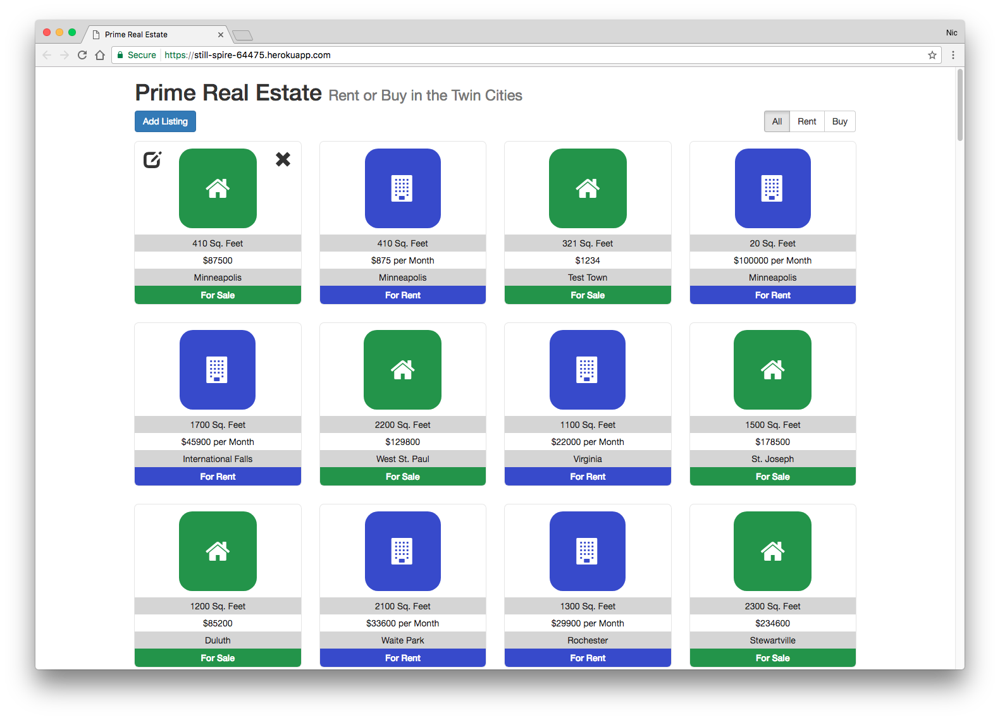

# Weekend Challenge 4 - Mongo and Bootstrap

This was the fourth Weekend Challenge completed during the course of Prime Digital Academy's Full Stack Engineering program.

The assignment for this project was to build a real estate listings page using Bootstrap, Express and MongoDB.

## Assignment
* Create a Full Stack application from the ground up using jQuery, Node, and MongoDB,
* Work with the data set that provided
* Use Bootstrap to present the data
* Account for the different data (“rent” versus “cost) and ensure that this is noted on the display of the information, by listing “For Rent” or “For Sale” based on which of the two properties that it has.
* Create an interface for adding additional properties to the collection. You will need to give the user an option for either a Rent property, or a Sale property.
* Host the application on Heroku and mLabs.

## Preview

## Technologies Used

* Database
  * MongoDB

* Server-side
  * NodeJS
  * Express
  * Mongoose

* Front-end
  * HTML
  * CSS
  * JavaScript
  * jQuery
  * Bootstrap

## Getting Started

To run the code locally:

1. Clone the repository
2. Run `npm install`.
3. Ensure the `postinstall` `grunt` script has created the `server/public/` directory.
4. Update the mongoURI variable in `app.js` to point to your own database or assign a URI to `process.env.MONGODB_URI`.
5. Run `npm start` and view the application at `localhost:5000`.

To work with the provided data:
* Download the provided `listingData.js` file,
* Run this command in your Terminal: `mongoimport --db realestate --collection listings --file listingData.js`
* Note that you will need to run this from the folder which you download the `listingData.js` to.
